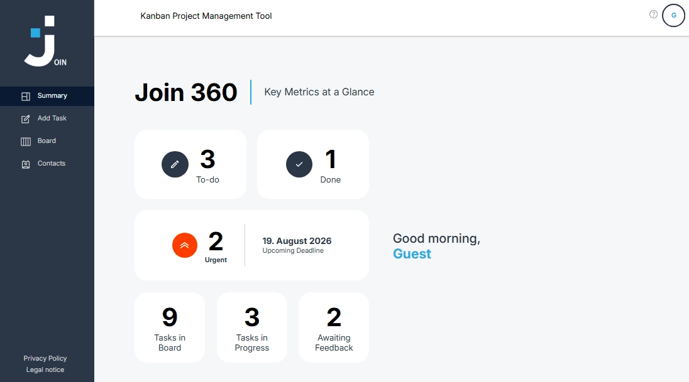

# Join

Join is a task and contact management application built with Angular and Firebase. It combines a Kanban board, task management, contact management, authentication, and a summary dashboard in a single-page application.

The project was developed as a team project during the Developer Akademie training program. Git and GitHub were used to coordinate development, manage feature branches, and integrate the work of multiple team members into the shared codebase.

<br>

[](https://join.juergen-malinowski.de)

<br>



---

## Setup / Quick Start

### Prerequisites

Make sure the following tools are installed:

- [Git](https://git-scm.com/)
- [Node.js](https://nodejs.org/) with npm

### Windows

```cmd
git clone https://github.com/Juergen-Malinowski/Join.git
cd Join
npm install
npm start
```

### macOS / Linux

```bash
git clone https://github.com/Juergen-Malinowski/Join.git
cd Join
npm install
npm start
```

After the development server has started, open:

```text
http://localhost:4200/
```

The application uses Firebase Authentication and Cloud Firestore. The Firebase project configuration required by the application is currently defined in `src/app/app.config.ts`.

---

## Table of Contents

- [Project Overview](#project-overview)
- [Main Features](#main-features)
- [Tech Stack](#tech-stack)
- [Project Structure](#project-structure)
- [Application Areas](#application-areas)
  - [Authentication](#authentication)
  - [Summary Dashboard](#summary-dashboard)
  - [Kanban Board](#kanban-board)
  - [Task Management](#task-management)
  - [Contact Management](#contact-management)
- [Data Model](#data-model)
- [Architecture](#architecture)
- [Responsive Design](#responsive-design)
- [Post-Project Refinement](#post-project-refinement)
- [Deployment](#deployment)
- [Documentation](#documentation)

---

## Project Overview

Join supports collaborative task organization through a Kanban-style workflow. Tasks can be created, edited, assigned to contacts, divided into subtasks, prioritized, and moved through the workflow states.

The application also provides contact management, user authentication, guest access, and a summary dashboard for task-related information.

The main workflow states are:

```text
To do
In progress
Await feedback
Done
```

---

## Main Features

- Email/password login and user registration
- Anonymous guest login
- Kanban board with four workflow columns
- Drag-and-drop task movement with Angular CDK
- Task creation, editing, and deletion
- Task priorities and task types
- Due dates and subtasks
- Assignment of contacts to tasks
- Contact creation, editing, and deletion
- Contact avatars with initials and assigned colors
- Summary dashboard based on task data
- Persistent application data with Cloud Firestore
- Firebase Authentication for registered and guest users

---

## Tech Stack

| Technology | Purpose |
| --- | --- |
| **Angular 20** | Application framework and standalone component architecture |
| **TypeScript** | Application logic and typed data models |
| **SCSS** | Component and responsive styling |
| **Angular Material** | UI components and dialogs |
| **Angular CDK** | Drag-and-drop functionality for the Kanban board |
| **AngularFire** | Angular integration for Firebase services |
| **Firebase Authentication** | Registered-user and anonymous guest authentication |
| **Cloud Firestore** | Persistent task, contact, assignment, subtask, and application-setting data |
| **RxJS** | Reactive Firestore streams and authentication state |
| **Angular Signals** | Local reactive UI state |
| **Git & GitHub** | Collaborative version control, feature-branch workflow, integration of team contributions, and repository management |

---

## Project Structure

The application is organized around feature areas, shared services, and typed data models.

```text
src/app/
├── firebase-services/
│   ├── auth-services.ts
│   └── firebase-services.ts
├── interfaces/
├── login/
│   ├── login.ts
│   └── main-page/
│       ├── add-task/
│       ├── board/
│       ├── contacts/
│       ├── summary/
│       ├── helper/
│       ├── legal-notice/
│       └── privacy-policy/
├── services/
├── shared/
├── types/
├── app.config.ts
└── app.routes.ts
```

The main application pages below `MainPage` are loaded through the Angular router. Shared interfaces and enums define the persisted application data structures.

---

## Application Areas

### Authentication

Join uses Firebase Authentication for registered users and anonymous guest sessions.

Supported flows include:

- login with email and password
- registration with name, email, and password
- anonymous guest login
- logout

When a registered user signs up, a corresponding contact document is created in Firestore using the Firebase Authentication UID as its document ID.

### Summary Dashboard

The summary area presents task-related information derived from the current Firestore data and provides an overview of the application's task state.

### Kanban Board

The board organizes tasks into four workflow columns:

```text
To do
In progress
Await feedback
Done
```

Angular CDK drag-and-drop is used to move tasks within or between columns. A changed workflow state is persisted in Firestore through the task's `status` field.

The board also provides task previews, task detail dialogs, editing flows, and task creation access.

### Task Management

Tasks contain the information required for planning and assignment, including:

- title
- description
- task type
- workflow status
- due date
- priority
- assigned contacts
- subtasks

The application supports creating, editing, and deleting tasks. Assignments and subtasks are stored as Firestore subcollections below their parent task.

### Contact Management

The contact area provides:

- grouped contact lists
- contact detail views
- contact creation
- contact editing
- contact deletion
- initials-based avatars
- persistent avatar colors

Registered users are also represented as contact documents so that user and task-assignment data can share the same contact model.

---

## Data Model

The main Firestore structure is:

```text
contacts/{contactId}

tasks/{taskId}
├── assigns/{assignId}
└── subtasks/{subtaskId}

appSettings/contacts
```

### Contact

```text
name
email
phone
color
isUser
```

### Task

```text
type
status
date
title
description
priority
```

Task types are represented by the `TaskType` enum:

```text
1 = UserStory
2 = TechnicalTask
```

Task workflow states are represented by `TaskStatus`:

```text
todo
in_progress
await_feedback
done
```

Each task assignment stores a `contactId`. Each subtask stores a `title` and its `done` state.

---

## Architecture

Join uses Angular standalone components and lazy-loaded feature routes. The application separates authentication, persistence, and reusable UI logic into dedicated services.

The central services are:

- `AuthService` for Firebase Authentication flows
- `FirebaseServices` for Firestore access and CRUD operations
- `UserUiService` for reusable presentation-related logic

Changing Firestore data is exposed to the UI primarily through RxJS observables, while write operations use asynchronous Firebase operations.

For a more detailed technical overview, see [docs/ARCHITECTURE.md](docs/ARCHITECTURE.md).

---

## Responsive Design

Join provides responsive layouts for viewport widths from **320 px to 3440 px**, covering small smartphones, tablets, standard desktop layouts, QHD, and ultrawide displays.

The application adapts navigation, dialogs, forms, contact views, and task-related layouts to the available viewport. On smaller screens, the Kanban board supports horizontal navigation and scrolling so that the four workflow columns remain usable without compressing task cards beyond a practical width.

Responsive behavior was validated across representative viewport sizes and around layout-specific breakpoints used by the application.

---

## Post-Project Refinement

After completion of the original team project, the application was further refined for portfolio use.

The post-project work focused on improving the existing implementation without changing the original application concept. This included targeted bug fixes, responsive optimization across mobile, tablet, desktop, and ultrawide layouts, improvements to mobile board navigation, documentation cleanup, refinement of code comments and JSDoc, updates to the legal and privacy information, and preparation of the application for production deployment.

The current repository therefore represents a technically refined and production-deployed version of the original team project.

---

## Deployment

The production version is publicly available at:

**https://join.juergen-malinowski.de**

The Angular production build is hosted as a static application on **ALL-INKL.COM** webspace. Apache serves the generated application files, while the repository's `public/.htaccess` provides the single-page application fallback by routing non-file requests to `index.html`.

HTTPS is enforced for the public deployment. Firebase Authentication and Cloud Firestore remain the application's external backend services for authentication and persistent application data.

---

## Documentation

Detailed technical architecture documentation is available here:

[Architecture Documentation](docs/ARCHITECTURE.md)
